<h3><code>dvmmisAfk@github ~ $ ./contributions.sh</code></h3>

  

<h3><code>dvmmisAfk@github ~ $ whoami</code></h3>

<table>
  <tr>
    <td valign="top"></td>
    <td valign="top"></td>
  </tr>
</table>

 

---

### <code>$ ls ~/projects</code>

| Project | Stack | Link |
|---|---|---|
| 🏦 Branch Visit Management System | MERN · PostgreSQL · REST | [live demo](https://tata-management-system.vercel.app/dashboard) |
| 🤖 LoanBot AI | FastAPI · React · Python | [repo](https://github.com/dvmmisAfk/loanbot_AI) |
| 🫁 Lung Cancer Detection System | Python · scikit-learn | [repo](https://github.com/dvmmisAfk/Lung-Cancer-Detection-System) |
| 📊 SEBI Investor Education Hub | MERN · REST | [repo](https://github.com/dvmmisAfk/SEBI-prototype) |

- **Branch Visit Management System** — RBAC across 3 roles, 20+ REST endpoints, real-time analytics dashboards.
- **LoanBot AI** — loan assistant with Video KYC, EMI calculation, and automated PDF report generation.
- **Lung Cancer Detection** — 98% accuracy on 1,000+ patient records; F1-score up 18% via hyperparameter tuning.
- **SEBI Investor Education Hub** — National Finalist at the SEBI Securities Market Hackathon among 1,000+ teams.

---

### <code>$ cat ~/research/*.bib</code>

| Title | Journal | Year |
|---|---|---|
| A Privacy-Preserving Approach to Cardiovascular Risk Prediction Through Synthetic Data and Ensemble Learning | IJNRD | 2026 |
| Predictive Modeling of Neoplastic Disorders of the Brain Using Machine Learning | IJRAR | 2025 |
| Neuro Stroke: An ML-Powered Framework for Early Stroke Prediction | International Research Journal | 2025 |

---

<code>B.Tech CS @ VIT Bhopal · Lucknow, India · heatmap regenerated daily by GitHub Actions</code>

